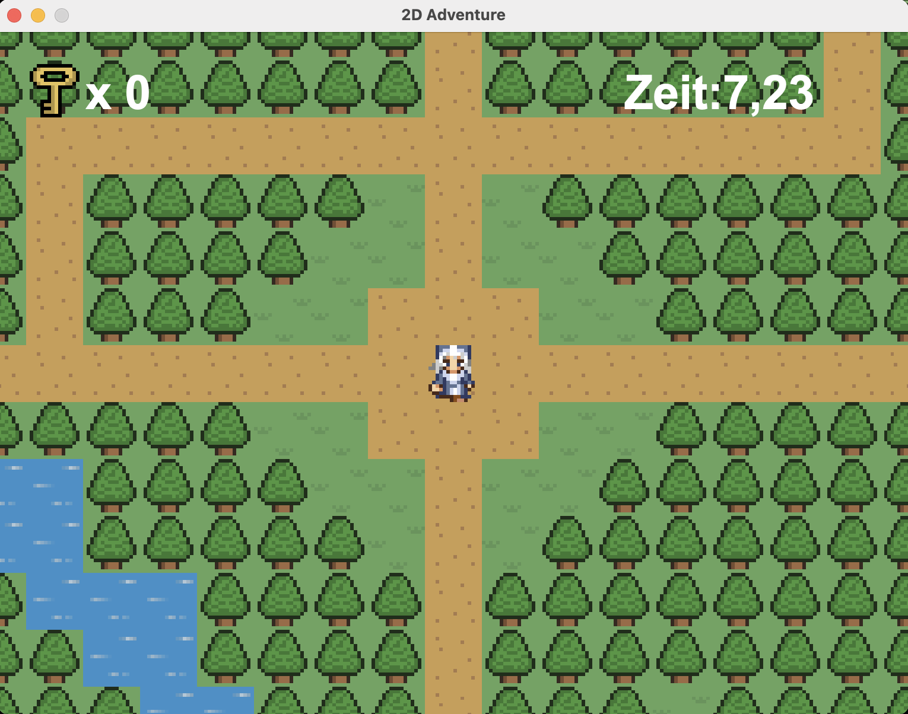
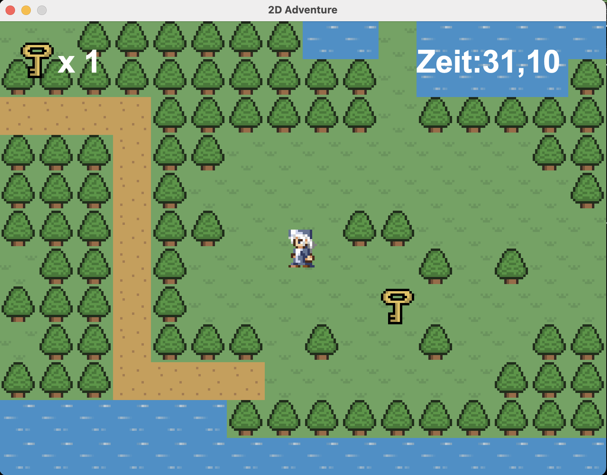
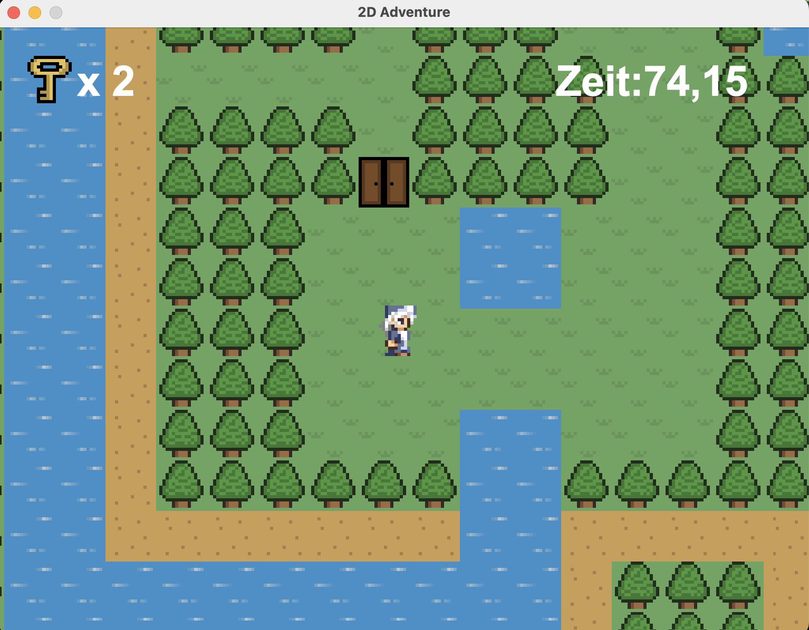

# 2D-Treasure-Hunter

Ein spannendes 2D-Abenteuer, bei dem der Spieler Hindernisse überwinden, Schlüssel sammeln und den Schatz finden muss.

## 🎮 Features

- **Erkundung der Welt**: Bewege dich durch eine 2D-Spielwelt, bestehend aus verschiedenen Kacheln wie Gras, Wasser, Sand und mehr.
- **Schlüssel sammeln**: Sammle Schlüssel, um verschlossene Türen zu öffnen.
- **Schatz finden**: Dein Ziel ist es, den versteckten Schatz zu finden, bevor die Zeit abläuft.
- **Kollisionserkennung**: Realistische Bewegung durch Kollisionserkennung mit Hindernissen wie Wänden und Bäumen.
- **Zeitlimit**: Behalte deine Spielzeit im Auge, um die Herausforderung zu meistern.

## 🛠️ Technologien

- **Programmiersprache**: Java
- **Framework**: Java Swing für die Benutzeroberfläche
- **Bildverarbeitung**: BufferedImage für das Laden und Anzeigen von Kacheln und Objekten
- **Kollisionserkennung**: Implementiert für Spielerbewegung und Interaktion mit der Umgebung

## 🚀 Spiel starten

1. **Voraussetzungen**:
   - Installiere die neueste [Java JDK-Version](https://www.oracle.com/java/technologies/javase-downloads.html).

2. **Projekt herunterladen**:
   - Klone das Repository:
     ```bash
     git clone https://github.com/AhmetErdem-U/2D-Treasure-Hunter.git
     ```
   - Navigiere in das Projektverzeichnis:
     ```bash
     cd 2D-Treasure-Hunter
     ```

3. **Spiel ausführen**:
   - Führe die JAR-Datei aus:
     ```bash
     java -jar 2D-Game.jar
     ```

## 📂 Projektstruktur

- `src`: Quellcodedateien
 - `entity`: Enthält die Klassen für Spieler und NPCs.
  - `main`: Hauptlogik und Spielsteuerung.
  - `object`: Enthält die Logik für Objekte wie Schlüssel, Türen und Schatztruhen.
  - `tile`: Kacheln und Weltkartenmanagement.
- `res`: Ressourcen wie Bilder und Kartenlayouts.
- `2D-Game.jar`: Kompilierte Version des Spiels.

## 🖼️ Screenshots

### Hauptbildschirm


### Gameplay


### Schatz gefunden!



Viel Spaß beim Spielen! 🎉
